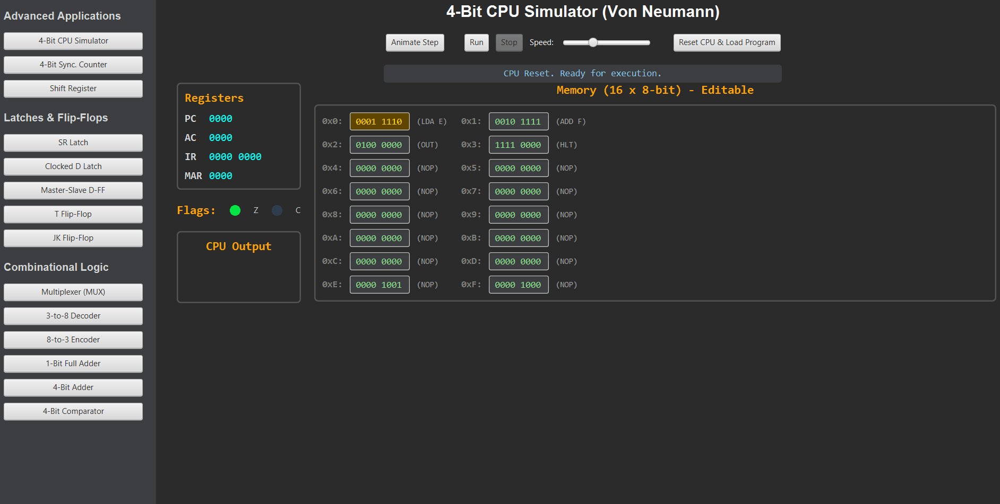
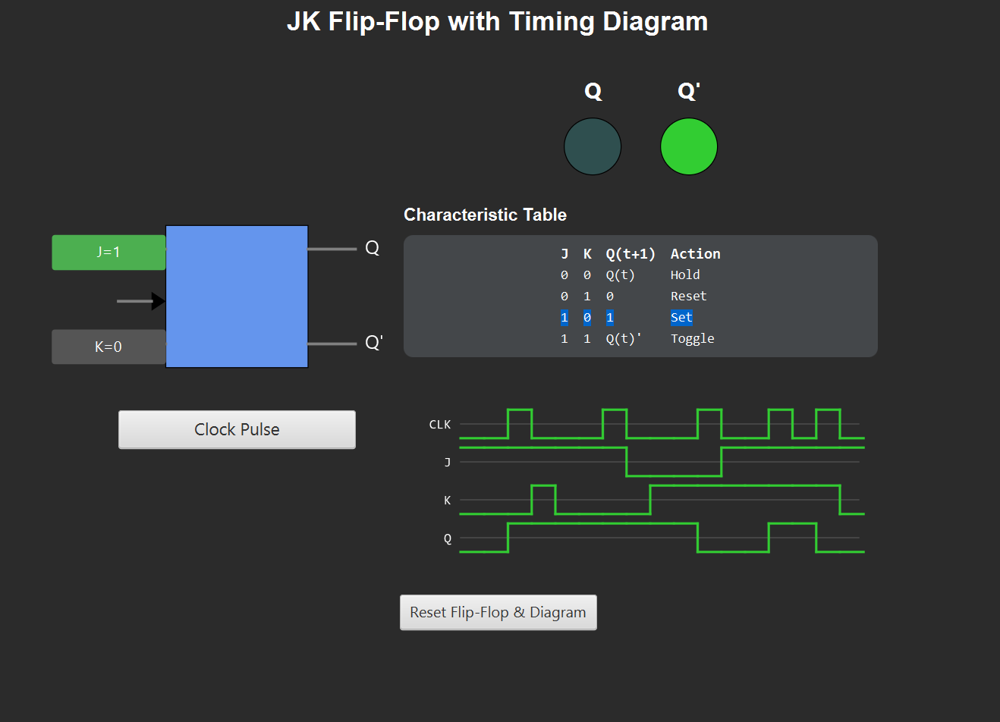

# Digital-Logic-Lab

  

<p align="center">
  
</p>

An interactive desktop application built with **JavaFX** to simulate and visualize fundamental digital logic circuits, from basic latches to a fully functional 4-bit CPU. This project was developed as a hands-on tool to solidify concepts learned in digital design courses, providing a dynamic way to see abstract theories in action.

## ✨ Features

The simulator is organized into a modular lab environment where each module represents a different digital component or application.

### The Capstone Project: 4-Bit CPU Simulator
The highlight of the lab is a fully animated Von Neumann architecture CPU that conceptually integrates many of the other components.

- **Interactive Memory:** Load and **edit** your own simple 4-bit programs and data directly in the UI.
- **Animated Fetch-Decode-Execute Cycle:** Each phase of the CPU's operation is visualized with highlighted components and data paths.
- **Register & Flag Visualization:** Watch the Program Counter, Accumulator, and other registers change in real-time. Status flags like `Zero (Z)` and `Carry (C)` are also visualized.
- **Mnemonic Display:** The simulator automatically translates 8-bit machine code into human-readable assembly mnemonics (e.g., `LDA E`, `ADD F`).
- **Full Execution Control:** `Animate Step` through the program instruction by instruction, or `Run` it automatically at an adjustable speed.

<p align="center">
  
</p>

### Sequential & Combinational Logic
Visualize the core principles of digital circuits with a rich set of modules.
- **Latches & Flip-Flops:** Explore SR, D, Master-Slave, T, and JK flip-flops. Key modules feature **dynamic timing diagrams** to visualize signal changes over time.
- **Combinational Circuits:** Interact with Multiplexers, Decoders, Encoders, Adders, and Comparators.

<p align="center">
  
</p>

### Practical Applications
See how basic components are combined to create more complex and meaningful systems.
- **4-Bit Up/Down Counter:** A synchronous counter with a **7-segment display** output.
- **Shift Register:** Visualize how data bits are "shifted" across a series of flip-flops.

## 🚀 Getting Started

You have two options to run the Interactive Digital Logic Lab on your machine.

### Option 1: Run the Installer (Recommended for Windows)
Download the pre-packaged installer. This does not require you to have Java installed on your system.

1.  Go to the [**Releases**](https://github.com/ulukayalperen7/Digital-Logic-Lab/releases) page of this repository.
2.  Download the `Digital-Logic-Simulator-[version].exe` file.
3.  Run the installer. A shortcut will be created on your desktop and in the Start Menu.

### Option 2: Run from Source (For Developers)
If you want to run the project from the source code, you will need:
- Java JDK 17 or higher
- Apache Maven

1.  Clone the repository:
    ```bash
    git clone https://github.com/ulukayalperen7/Digital-Logic-Lab.git
    ```
2.  Navigate to the project directory:
    ```bash
    cd Digital-Logic-Lab
    ```
3.  Compile and run the application using Maven:
    ```bash
    mvn clean javafx:run
    ```

## 🛠️ Building the Installer from Source

If you have made changes and want to create a new `.exe` installer, run the following Maven command:
```bash
mvn clean package
```
This will compile the code, create a fat JAR, and then use `jpackage` to generate a native installer in the `jpackage-output/` directory.

## 💻 Tech Stack
- **Language:** Java 17
- **Framework:** JavaFX 17
- **Build Tool:** Apache Maven
- **Packaging:** `maven-shade-plugin` & `jpackage-maven-plugin`
